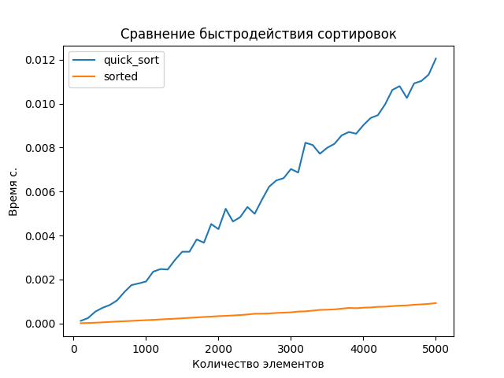

# Intern-Server-Core-Programmer

Тестовое задание на позицию Intern Server Core Programmer

## Задание 1

### Задача

На языке Python или C++ написать алгоритм (функцию) определения четности целого числа, который будет аналогичен
нижеприведенному по функциональности, но отличен по своей сути.
Объяснить плюсы и минусы обеих реализаций.
**Пример:**

``` python
def isEven(value): 
    return value % 2 == 0
```

### Решение

```python
# исходная функция, принимает целые числа, возвращает Истина если число четное, иначе Ложь
# Плюсы: Тривиальность
# Минусы: Время выполнения зависит от величины value
def is_even(value):
    return value % 2 == 0


# функция с использованием побитовых операций, принимает целые числа, возвращает Истина если число четное, иначе Ложь
# Плюсы: константное время выполнения
# Минусы: принцип работы может быть неочевидным для стороннего программиста
def is_even_bitway(value):
    return not bool(value & 1)


lookup_table = [True, False, True, False, True, False, True, False, True, False, True, False, True, False, True, False]


# функция с использованием табличной информации, принимает целые числа, возвращает Истина если число четное, иначе Ложь
# Плюсы: константное время выполнения, принцип работы может быть реализован на устройстве без АЛУ
# Минусы: ограниченность допустимых входных данных, необходимость в памяти
def is_even_lookupway(value):
    return lookup_table[value]


# функция с использованием "забавного" подхода, принимает целые числа, возвращает Истина если число четное, иначе Ложь
# Плюсы: артхаусно
# Минусы: значительно более долгое время выполнения
def is_even_flipway(value):
    _is_even = True
    for _ in range(abs(value)):
        _is_even = not _is_even
    return _is_even
```

### Задание 2

## Задача

На языке Python или С++ написать минимум по 2 класса реализовывающих циклический буфер FIFO. Объяснить плюсы и минусы
каждой реализации.

Оценивается:

1. Полнота и качество реализации
2. Оформление кода
3. Наличие сравнения и пояснения по быстродействию

## Решение

```python
from LinkedList import LinkedList


# Класс реализующий кольцевой FIFO буфер заданного размера
# Реализация на массиве
class FIFOListWay:
    def __init__(self, max_size: int):
        self.maxsize = max_size
        self.buffer = [None] * self.maxsize
        self.read_index = 0
        self.write_index = 0

    # принимает объект data, добавляет его в буффер
    def push(self, value):
        self.write_index %= self.maxsize
        self.buffer[self.write_index] = value
        self.write_index += 1

    # возвращает и удаляет элемент из буффера по принципу FIFO
    def pop(self):
        self.read_index %= self.maxsize
        res = self.buffer[self.read_index]
        self.buffer[self.read_index] = None
        self.read_index += 1
        return res

    # Возвращает Истина если буфер пустой иначе Ложь
    def is_empty(self):
        i = 0
        while i != self.maxsize:
            if self.buffer[i] is not None:
                return False
            i += 1
        return True

    # Возвращает Истина если буфер полный иначе Ложь
    def is_full(self):
        i = 0
        while i != self.maxsize:
            if self.buffer[i] is None:
                return False
            i += 1
        return True


# Класс реализующий кольцевой FIFO буфер заданного размера
# Реализация на односвязном списке
class FIFOLinkedListWay:
    def __init__(self, max_size: int):
        self.max_size = max_size
        self.buffer = LinkedList()
        self.max_size = max_size
        for _ in range(max_size):
            self.buffer.expand(None)
        self.first = self.buffer.head

    # принимает объект data, добавляет его в буффер
    def push(self, data):
        self.buffer.push(data)

    # возвращает и удаляет элемент из буффера по принципу FIFO
    def pop(self):
        res = self.first.data
        self.first.data = None
        self.first = self.first.next
        return res

    # Возвращает Истина если буфер пустой иначе Ложь
    def is_empty(self):
        current = self.first
        for _ in range(self.max_size):
            if current.data is not None:
                return False
            current = current.next
        return True

    # Возвращает Истина если буфер полон иначе Лжь
    def is_full(self):
        current = self.first
        for _ in range(self.max_size):
            if current.data is None:
                return False
            current = current.next
        return True
```

Проведем тесты скорости работы

```commandline
initialization speed for FIFOListWay: 1.2073999569111037e-06
initialization speed for FIFOLinkedListWay: 0.029014613699946495
push speed for FIFOListWay: 1.4299996473710054e-07
push speed for FIFOLinkedListWay: 7.470999480574391e-07
pop speed for FIFOListWay: 1.3939997734269128e-07
pop speed for FIFOLinkedListWay: 6.641000072704629e-07
```

Проанализировав результаты становится очевидно что решение на _list_ работает
гораздо быстрее чем на _linked_list_. Причиной такой разницы в скорости может быть разность в
устройстве _list_ и _Linked_list_: в _list_ элементы "лежат" в памяти подряд, т.е. после первого элемента идет второй и
так далее, в _linked_list_ все элементы находятся в случайныч местач памяти, что делает доступ к ним медленнее, но
позволяет работать в условиях высокой фрагментированности памяти.

## Задание 3

### Задача

На языке Python или С++ предложить алгоритм, который быстрее всего (по процессорным тикам) отсортирует данный ей массив
чисел. Массив может быть любого размера со случайным порядком чисел (в том числе и отсортированным). Объяснить, почему
вы считаете, что функция соответствует заданным критериям.

### Решение

```python
def partition(array, low, high):
    # choose the rightmost element as pivot
    pivot = array[high]

    # pointer for greater element
    i = low - 1

    # traverse through all elements
    # compare each element with pivot
    for j in range(low, high):
        if array[j] <= pivot:
            # If element smaller than pivot is found
            # swap it with the greater element pointed by i
            i = i + 1

            # Swapping element at i with element at j
            (array[i], array[j]) = (array[j], array[i])

    # Swap the pivot element with the greater element specified by i
    (array[i + 1], array[high]) = (array[high], array[i + 1])

    # Return the position from where partition is done
    return i + 1


def quick_sort(array, low, high):
    if low < high:
        # Find pivot element such that
        # element smaller than pivot are on the left
        # element greater than pivot are on the right
        pi = partition(array, low, high)

        # Recursive call on the left of pivot
        quick_sort(array, low, pi - 1)

        # Recursive call on the right of pivot
        quick_sort(array, pi + 1, high)
```

### Пояснение

Хотелось бы отметить что идеальной и сортировки в общем случае не существует, по этой причине мы и имеем такое
разнообразие
сортировок, вед иначе все бы пользовались одной единствено верной сортировкой. Но если подойти к этой задаче следующим
образом:
'Какая сортировка будет наилучшей чаще всего?', то на ум сразу приходит _qsort_, так считают и многие
разработчики языков программирования, например _qsort_ находится в _stdlib.h_ - стандартной библиотеке языка **C**.

Проведём эксперимент и сравним _qsort_ с другими популярными сортировками:


Из эксперимента видно что _qsort_ является самой быстрой из популярных сортировок

Сравним _qsort_ с встроенной в питон сортировкой



На графике видно что _qsort_ проигрывает встроенной в питон сортировке, поэтому собственная реализация сортировки при
работе с питоном чаще всего не требуется. 